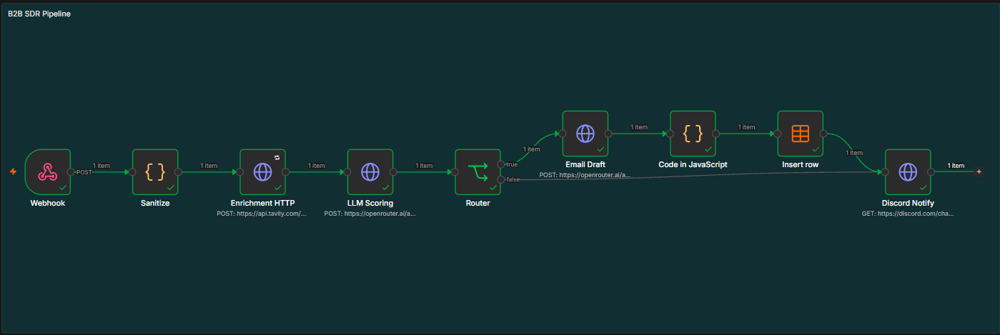
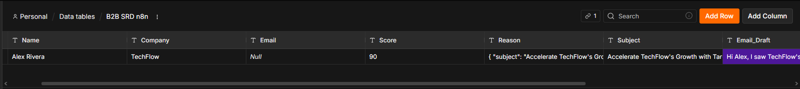
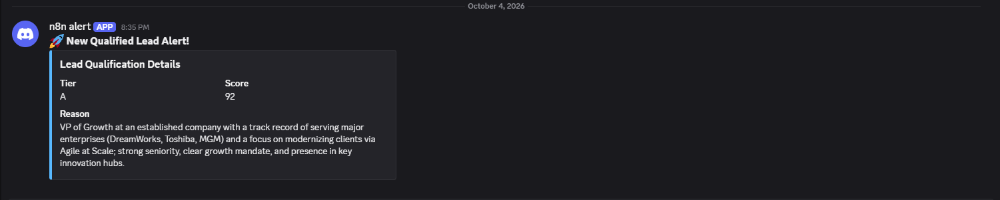

# n8n-b2b-sdr-pipeline

An automated, enterprise-grade B2B Lead Enrichment and AI SDR Qualification pipeline built on n8n. It ingests raw webhook leads, enriches context via Tavily Search, scores buying intent with LLMs, drafts hyper-personalized outreach, and routes qualified leads directly to Baserow DB and Discord alerts.

## Project Visualization

### 1. n8n Workflow Architecture


### 2. Baserow Data Table Structure


### 3. Discord Sales Notification


## Key Features
- **Automated Ingestion & Sanitization:** Efficiently receives and sanitizes incoming lead data via Webhooks.
- **Deep Web Intelligence:** Real-time business/company enrichment powered by Tavily Search.
- **LLM Qualification & Scoring:** Intelligent lead scoring based on ICP criteria with transparent AI reasoning.
- **Dynamic Routing:** Automated decision-making to prioritize and route high-quality leads.
- **Personalized Outreach:** Generates hyper-personalized email drafts based on enriched lead context.
- **Data Integrity Layer:** JavaScript-based validation to ensure JSON schema consistency with Baserow.
- **Centralized Storage & Alerting:** Seamless integration with Baserow for data persistence and Discord for real-time sales team notifications.

## Prerequisites
To run this pipeline, you need the following API keys and services:
- **TAVILY_API_KEY:** For web research and enrichment.
- **OPENROUTER_API_KEY:** For LLM-based scoring and email drafting.
- **BASEROW_DATABASE_TOKEN:** For data storage and synchronization.
- **DISCORD_WEBHOOK_URL:** For real-time sales team alerts.

## Installation

1. **Clone the repository:**
   
```bash
   git clone https://github.com/<your-username>/n8n-b2b-sdr-pipeline.git
Import Workflow:

Open your n8n instance.
Go to Workflows -> Import from File.
Select the workflow/b2b-sdr-pipeline.json file.
Configure Credentials:

Add your API keys (Tavily, OpenRouter, Baserow, Discord) within the n8n Credentials manager.
Prepare Baserow:

Create a table in Baserow with the following columns: Name, Company, Email, Score, Reason, Subject, Email_Draft.
Activate:

Toggle the workflow to Active mode.
Use the generated Production Webhook URL to start receiving leads.
License
Distributed under the MIT License. See LICENSE for more information.
